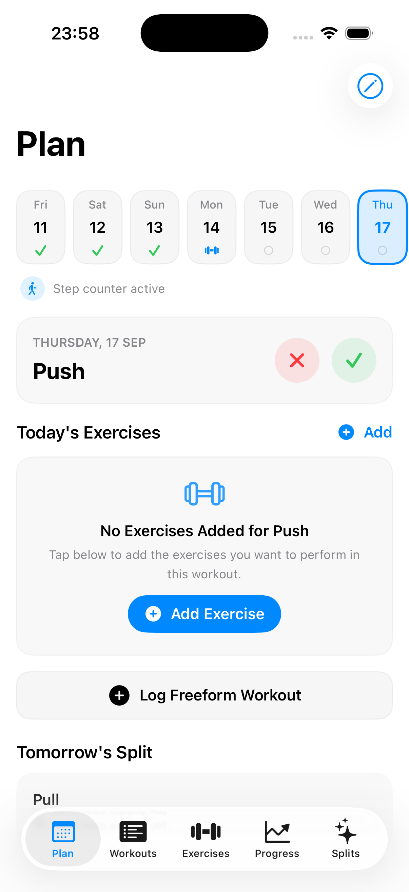
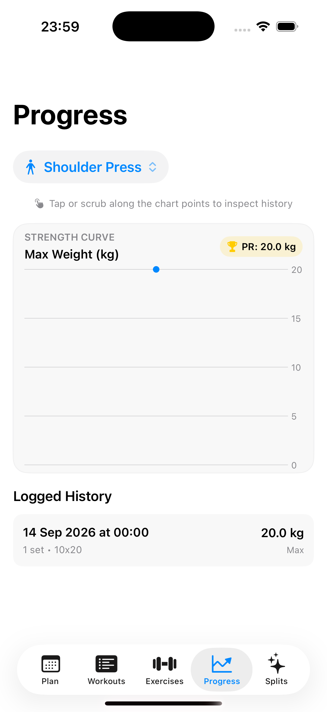
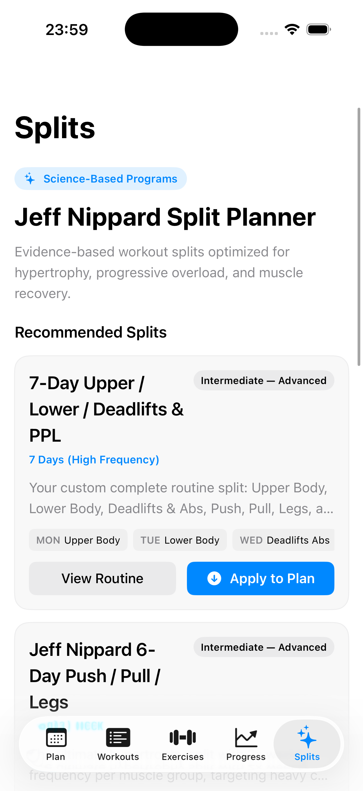
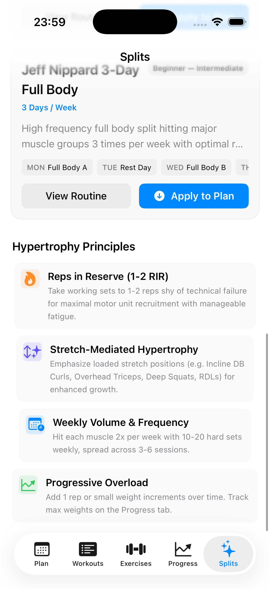

# GymTracker

A local-first iOS workout tracker and hypertrophy split planner built with SwiftUI and SwiftData. Zero accounts, no cloud sync, no tracking, and no network dependencies -> all your workout history, splits, and progress photos stay strictly on your device.

---

## 📱 Screenshots

<p align="center">
  
  
  
  
</p>

---

## ✨ Features

- **Plan & Routine Tracker**
  - **7-Day Interactive Date Strip** — Tap any date on the top carousel to inspect that day's logged sets, volume, and routine check-in status.
  - **Quick Status Actions** — Simple **Done (✓)** and **Skip (✕ with reason)** actions with real-time status badges.
  - **Live Auto Step Counter** — Tracks daily step counts via CoreMotion (`CMPedometer`) automatically in the background without requiring manual clicks.
  - **Inline Set Logging** — Expandable exercise rows with quick weight adjustment chip presets (`-2.5`, `+2.5`, `+5 kg`) and instant "+ Add Exercise" capability.

- **Jeff Nippard Science-Based Split Planner**
  - Curated evidence-based split templates:
    - **7-Day Upper / Lower / Deadlifts Abs & PPL** *(Active Default Routine)*
    - **6-Day Push / Pull / Legs (PPL)**
    - **4-Day Upper / Lower Split**
    - **3-Day Full Body Split**
  - **One-Tap Apply to Plan** — Automatically configures and populates your active weekly routine.
  - **Hypertrophy Principles Guide** — Built-in science guidelines on *1-2 RIR (Reps in Reserve)*, *Stretch-Mediated Hypertrophy*, *Volume & Frequency*, and *Progressive Overload*.

- **Workouts & Session Logging**
  - Log sets with reps and weight.
  - **Full Workout Editing** — Reorder sets, edit past workout details, update timestamps, or delete sets via swipe actions.
  - Session summaries with total volume and sets count.

- **Exercise Catalog & Progress Photos**
  - Filter by muscle group (*Chest, Back, Shoulders, Legs, Biceps, Triceps, Forearms, Abs*).
  - Track Personal Record (PR) max weights per exercise.
  - Form-check and progress photo gallery with local downscaling and full-screen inspection.

- **Strength Progress & Interactive Analytics**
  - Swift Charts progression graph with AreaMark gradient curves.
  - **Point-Click Inspection** — Tap or scrub along the chart points to inspect exact dates, max weights lifted, PR badges, and delta improvements (`+X kg` / `-X kg`).
  - History list linked with interactive chart highlighting.

---

## 🛠️ Requirements

- Xcode 16 or later
- iOS 17.0+ deployment target
- [XcodeGen](https://github.com/yonaskolb/XcodeGen) (`brew install xcodegen`) — the `.xcodeproj` is generated from `project.yml`

---

## 🚀 Getting Started

```bash
git clone https://github.com/ManthanNimodiya/GymTracker.git
cd GymTracker
xcodegen generate
open GymTracker.xcodeproj
```

Build and run on the iOS Simulator or a physical iPhone/iPad.

---

## 🏗️ Architecture

- **SwiftUI + SwiftData** for declarative UI and local data persistence (`Exercise`, `WorkoutSession`, `ExerciseSet`, `ProgressPhoto`, `PlanDay`, `PlanExercise`, `DayCheckIn`).
- **Swift Charts** for strength progression and PR tracking.
- **CoreMotion** (`CMPedometer`) for step counting — works with standard motion permissions without requiring paid Apple Developer HealthKit entitlements.
- **Zero Third-Party Dependencies**.

---

## 🔒 Privacy

Everything is stored locally on your device via SwiftData. No analytics, no third-party SDKs, and no network requests.
